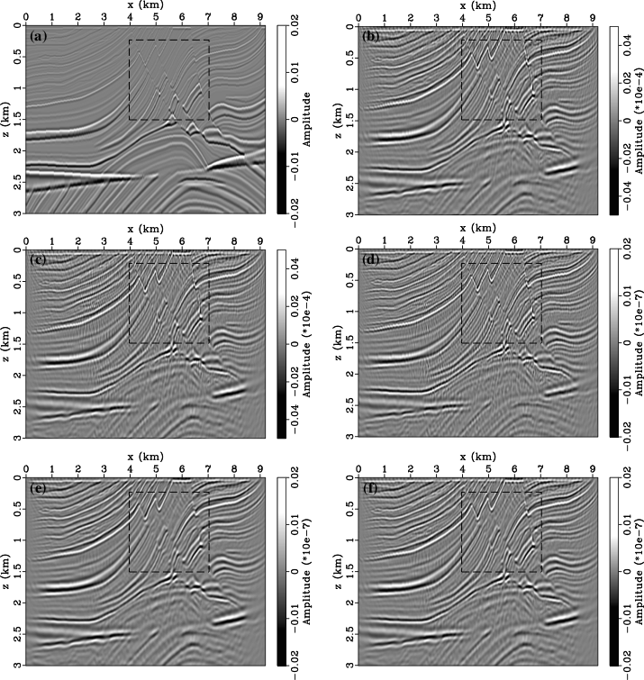

# Direct imaging of simultaneous-source data

## Introduction

Simultaneous-source acquisition technology can obtain better spatial-sampled blended seismic data with significantly faster efficiency in field survey. However, the strong cross-talk noise would be introduced in the final image by directly imaging of blended data. To solve this problem, I propose three direct imaging methods of blended-data.

This part of work is my research study at PhD period.

## Prerequisites

The source code is developed based on Magdagscar, which is an open-source software package for multidimensional data analysis and reproducible computational experiments.

You can read the [installtion guide](http://www.ahay.org/wiki/Installation) of Magdagscar.

## Source Description

The file tree is as follow:

```bash
── README.md
├── example
│   └── SConstruct
├── images
│   └── lsrtm_fig9.png
└── pzhang
    ├── Mlsprertm2d.c
    ├── Mlsrtmse.c
    ├── Mlsrtmwp.c
    ├── Mmod2refl.c
    ├── Mprertm2d_v03.c
    ├── Mprertm2d_v04.c
    ├── Msetspk.py
    ├── SConstruct
    ├── dbg.c
    ├── laplac2.c
    ├── lsprertm2d.c
    ├── lsrtmsr.c
    ├── prertm2d_v03.c
    └── prertm2d_v04.c
```

1. `README.md` : The file you are reading.
2. `example` : Demo example
3. `images` : images folder
4. `pzhang` : source code folder

## Compile

1. Install Magdagscar
2. cp `pzhang` folder to `path_to_madagascar/user/`
3. cd into `path_to_madagascar` folder and execute follow command:

```bash
$ scons -Q
$ make install
```

The Magdagscar construct program will automatic generate the header file, compile and link the source file and move your executable file to `$RSF_ROOT/bin` folder.

## Example

In this example, The `SConstruct` file will download the Marmousi model from internet, then generate the common-shot-gather data using finite-difference method.

After that, the blended-data will be simulated using zero-delay encoding strategy.

In the migration imaging process, this example will generate three difference migration results:

1. RTM result of conventional acquisition
2. RTM result of simultaneous-source acquisition
3. LSRTM result of blended-data after 5 iterations
4. SE-LSRTM result of blended-data after 5 iterations
5. WSE-LSRTM result of blended-data after 5 iterations



The corresponding relationships in the above figure are as follows:

(a) true reflecitity

(b) -> 1

(c) -> 2

(d) -> 3

(e) -> 4

(f) -> 5
 
